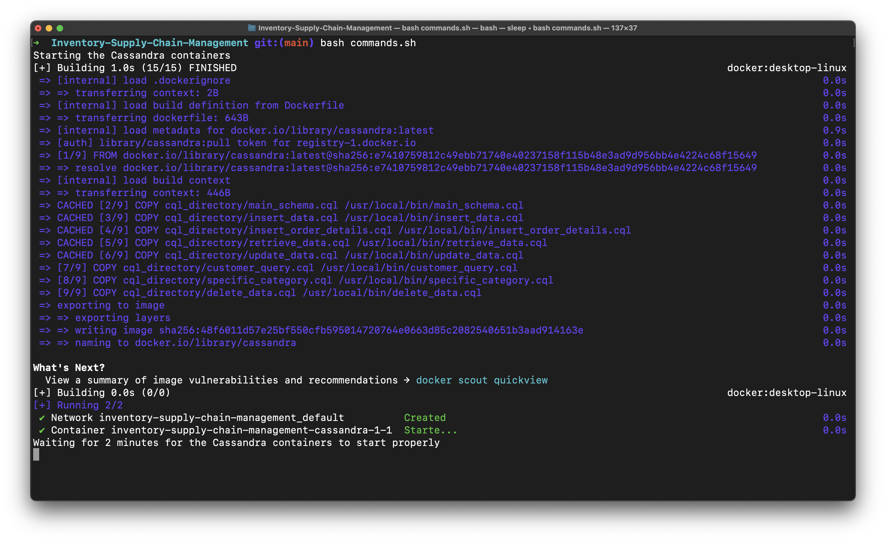
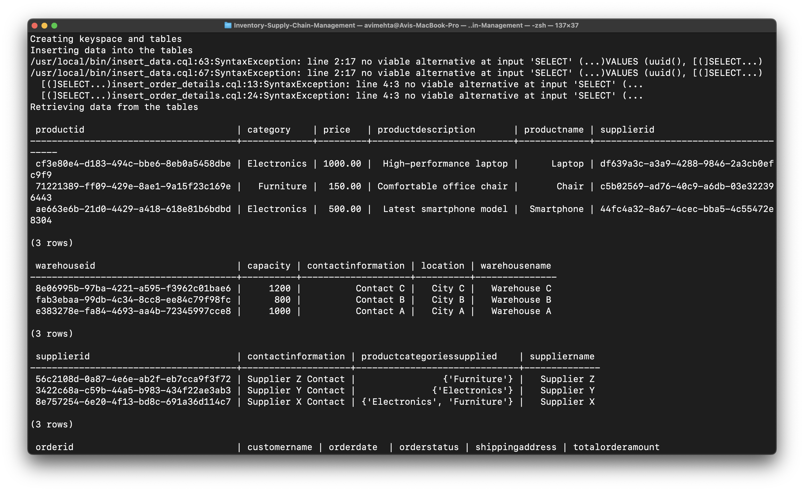
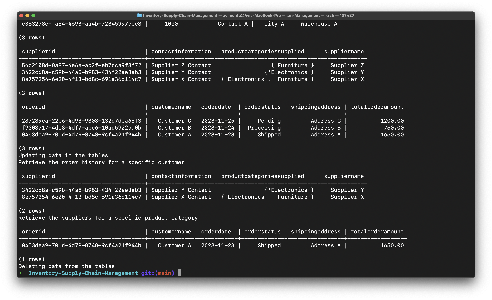

# ISP_Part5

## Overview

This part implements a distributed NoSQL database system using Apache Cassandra. It focuses on understanding data storage and retrieval processes within the context of inventory and supply chain management. The system is designed to manage products, warehouses, suppliers, orders, and related operations in a scalable and efficient manner.

## Problem Statement

The goal is to develop a NoSQL database system tailored to the specific needs of inventory and supply chain management. The system should efficiently handle various data types and relationships pertinent to this domain.

## Features

- **NoSQL Data Modeling**: Custom data schema and model designed for inventory and supply chain management.
- **CRUD Operations**: Implementation of Create, Read, Update, Delete operations for managing data.
- **Data Retrieval and Queries**: Sample queries to showcase database functionality and data retrieval capabilities.

## Components

1. **Cassandra Database**: A distributed NoSQL database used for storing and managing large amounts of data.
2. **Docker**: Containerization of the Cassandra database for easy deployment and scalability.
3. **CQL Scripts**: Cassandra Query Language scripts for creating schema, inserting data, updating, and querying.

## Installation and Setup

1. **Docker and Docker Compose**: Ensure Docker and Docker Compose are installed on your system.
2. **Build and Run Containers**:
   - Use `docker build -t cassandra .` to build the Cassandra image.
   - Use `docker-compose up -d` to start the containers.
3. **Database Initialization**:
   - Execute `docker exec -i inventory-supply-chain-management-cassandra-1-1 cqlsh -f /usr/local/bin/main_schema.cql` to create the keyspace and tables.
   - Insert data using the provided CQL scripts or directly run commands.sh to run the entire project.
4. **Database Access**:
   - Use `docker exec -it inventory-supply-chain-management-cassandra-1-1 cqlsh` to access the Cassandra shell.
   - Use `docker exec -it inventory-supply-chain-management-cassandra-1-1 bash` to access the container shell.

## Usage

- **CRUD Operations**: Use the provided CQL scripts to perform CRUD operations on the database.
- **Data Retrieval**: Execute specific queries to retrieve data related to orders, products, warehouses, etc.

## Project Structure

- **Dockerfile**: Configuration for building the Cassandra Docker image.
- **docker-compose.yml**: Defines services, networks, and volumes for the Cassandra containers.
- **cql_directory/**: Contains all CQL scripts for schema creation, data insertion, updating, and deletion.

## Sample Queries

- Retrieve details of all products.
- Get information about specific warehouses.
- Fetch orders for a particular customer.
- Update product prices and order statuses.

## Deliverables

- **Code/Scripts**: Dockerfile, docker-compose file, and CQL scripts.
- **Documentation**: This README file.
- **Snapshots**: Screenshots or snapshots demonstrating the functionality.

## Tools

- **Cassandra**: For database management.
- **Docker**: For containerization and deployment.
- **Bash Script**: For automating the setup and initialization process.

## Outputs and Screenshots

- **Docker Containers**: Cassandra containers running on Docker.

- **CQL Scripts**: CQL scripts for creating schema, inserting data, updating.

- **CQL Scripts**: CQL scripts for querying.

## Conclusion

This project demonstrates the implementation of a NoSQL database system using Apache Cassandra, tailored for inventory and supply chain management. It highlights how Cassandra can be used to manage complex data relationships and large-scale data in a distributed environment.

---